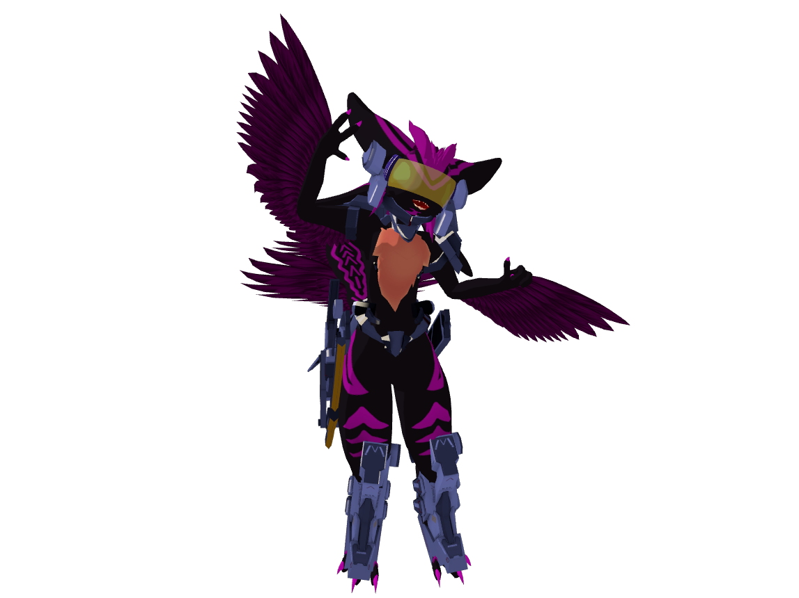

# ラパール

## パーソナルデータ

### 生まれの特徴

| 性別  |        種        |       |       |
| :---: | :--------------: | :---: | :---: |
|  男   | スターアヴァリ |       |       |

### スターアヴァリ

宇宙をさまようアヴァリ種。この世界においては外来種であり、地球には存在しない種。
本来は地上では生存不可能な生物学的特徴を有しているが、わずかな身体改造によって殆どの環境に適応できる体にすることができる特徴も持っている。
小さな群れをなして生活をする種であり、孤立すると発狂して死んでしまう。

### 生い立ち

ラパールの卵は極地にて発見され、医師団体『聖龍医師団』に保護された。しかし彼の生身の体にとって地球はあまりにも過酷すぎる環境であるために、特別な収容部屋にて成長させる必要があった。極寒で空気成分の異なる部屋であるゆえ、ラパールのそばに寄れる人は居なく精神異常を起こすことがしばしばあった。

そんなラパールを助けるために現れたのがリネルとテラートだった。2人は初めは窓越しでの交流をしていたが、適応スーツを着て部屋で過ごすこともあったようだ。そして、2人はラパールを外で生存できるようにするための「おつかい」を成功させ、生命維持装置を得たラパールは外の世界で暮らせるようになった。

施設を出てからはリネルとテラートと共に旅を続けている。

## 能力

### 基礎能力

| 体力  | 機敏  | 知性  | 精神  |
| :---: | :---: | :---: | :---: |
| ★★□□□ | ★★★★★ | ★★★★□ | ★★□□□ |

## キャラクターの由来

- 種族: [アヴァリ](https://avali.fandom.com/wiki/The_Official_Avali_Wiki) (created by RyuujinZERO)
