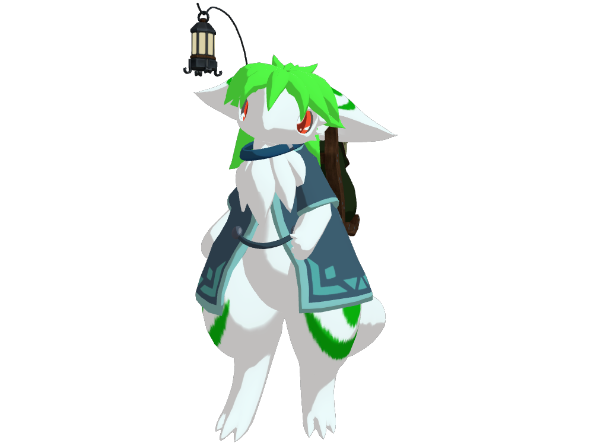

# リネル

## パーソナルデータ

### 生まれの特徴

| 性別 | 種             |      |      |
| :--- | :------------- | :--- | :--- |
| 女   | ピュアリコルー |      |      |

### 性別に関する議論

リネルは自身を女であると主張しているが、種族の生物的特徴においては性別は定義されていない。
しかし旅人の間では、原則個性としての性別を重視している為、ここでは女性であるとする。

### ピュアリコルー

大昔にある研究団体が「理想的な生命体」を目的に生産されたとされるピュア系統のリコルー種。
真っ白な体毛とわずかな模様が特徴。
個体数が非常に少なく、詳細はよく分かっていない。

### 生い立ち

リネルの卵 (正確には植物の種子) は廃棄された研究設備にて、幼少期のテラートが発見したものと思われている。発見後は医師団体『聖龍医師団』によってテラートとともに保護された。

幼少期はほとんどの時間をテラートと過ごし、時には周囲の人々を手助けしていた。同じ施設で保護されていたラパールもリネル達によって助けを受け、リネル達に加わるようになった。

成人期とともに保護施設から独立し、3人と仲のよい旅を続けている。

## 能力

### 基礎能力

| 体力  | 機敏  | 知性  | 精神  |
| :---: | :---: | :---: | :---: |
| ★□□□□ | ★★★★□ | ★★★★□ | ★★★□□ |

### 固有能力

(よくわかっていない)

### 弱点

(よくわかっていない)

### 好きなスキル

- エレメント: ヒール (協調のスキル)
    - このエレメントを付けた行動はどんなものでも傷を癒やすものになる。自分に対する回復力は減る。
- エレメント: ウォーター (制圧のスキル)
    - このエレメントを付けた攻撃は、水圧の力でなんでも吹き飛ばすようになる。重たい装備をする相手を大きく怯ませられるが、最終的なダメージは減少する。

## キャラクターの由来

- 種族: [リコルー](https://wezalsya.jimdofree.com/%E5%B0%8F%E3%81%95%E3%81%AA%E6%B0%91/%E3%83%AA%E3%82%B3%E3%83%AB%E3%83%BC/) (created by 幻遊童子)
- 名前: リーキ (Leek)、ネギ、リコルー
