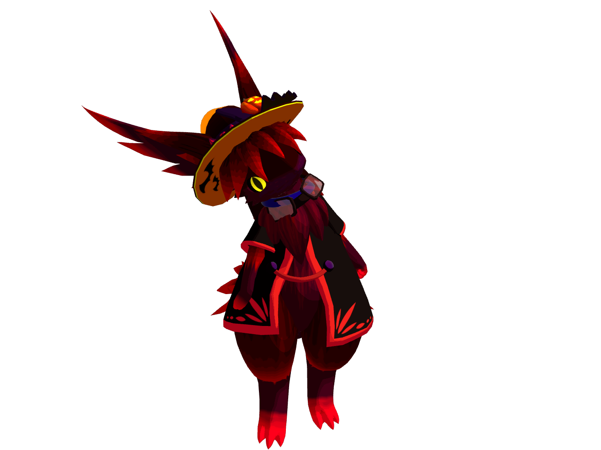

# テラート

## パーソナルデータ

### 生まれの特徴

| 性別  |        種        |       |       |
| :---: | :--------------: | :---: | :---: |
|  男   | テラーティオール |       |       |

### 性別に関する議論

テラートは自身を男であると主張しているが、種族の生物的特徴においては性別は定義されていない。
しかし旅人の間では、原則個性としての性別を重視している為、ここでは男性であるとする。

### テラーティオール

攻撃的生物の多い、暗闇の山岳地帯でわずかに原生する、黒基調のティオール種。
本来のティオールと比べて肉体能力が非常に高い。
殆どが単独行動であり、獲物に空中から飛びかかって首をへし折る襲撃方法を主としている。

### 生い立ち

テラートの生まれの地は現在のところ不明となっている。リネルの卵を抱えて医師団体『聖龍医師団』に保護されたことで初めて文明に知られることになる。

幼少期は人見知りが激しくリネル以外の交流を交わそうとしなかった。リネルの要望に答えるために、設備を壊したりすることも多々。

リネルに頼まれ、同じく保護されていたラパールを助けてからは、他者とも関わることが増えてきたが、荒々しい性格に戸惑う人が殆ど。

施設を出てからはリネルのボディーガードとして旅を続けている。

## 能力

### 基礎能力

| 体力  | 機敏  | 知性  | 精神  |
| :---: | :---: | :---: | :---: |
| ★★★★★ | ★★□□□ | ★★□□□ | ★★□□□ |

### 固有能力

- モンスターストレングス
    - 見た目とは桁違いの筋力と魔力を持つ。

### 弱点

(よくわかっていない)

### 好きなスキル

(よくわかっていない)

## キャラクターの由来

- 種族: [ティオール](https://wezalsya.jimdofree.com/%E5%B0%8F%E3%81%95%E3%81%AA%E6%B0%91/%E3%83%86%E3%82%A3%E3%82%AA%E3%83%BC%E3%83%AB/) (created by 幻遊童子)
- 名前: テラー (Terror)
